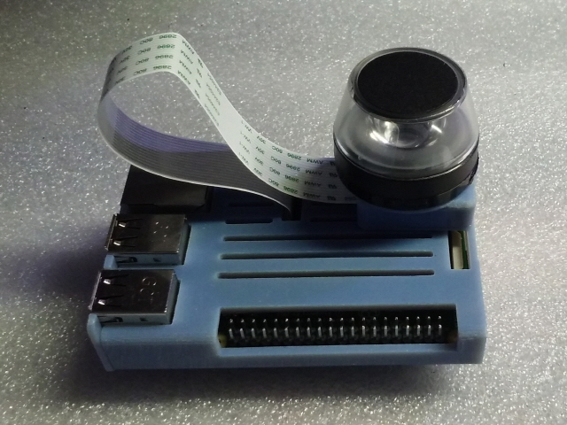
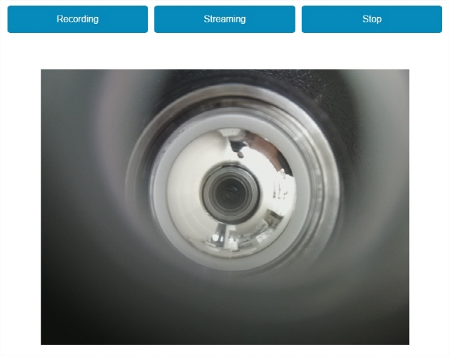

# raspi360livestream #
- 360 livestream with raspberry's picam

### Major components ###
- H/W : Raspberry3 + Picam
- S/W : raspbian jessie + Python2.7 + SimpleCV + OpenCV + mjpeg-streamer 

### Snapshot ###

======
- Phase 1 : Fish eyes's LiveStreaming

- Phase 2 : Dewarped image's LiveStreaming

### Reference ###
- [https://github.com/jacksonliam/mjpg-streamer](https://github.com/jacksonliam/mjpg-streamer)
- [https://github.com/kscottz/dewarp](https://github.com/kscottz/dewarp)

### Author ###
*evan.kim@kaist.ac.kr*
